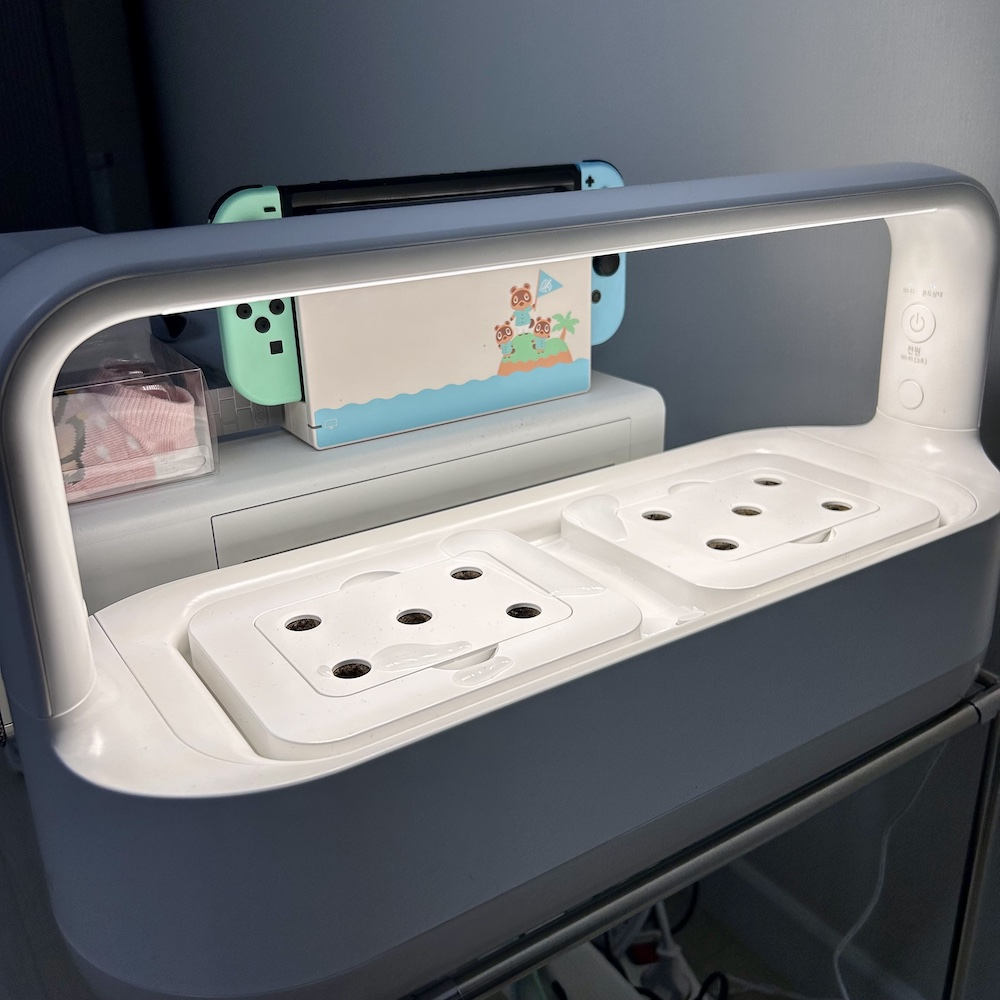

WideQ v2
=====

- Support LG ThinQ v2
- Support LG TIIUN MINI (Look at tiiun.py)

A library for interacting with the "LG SmartThinq" system, which can control heat pumps and such. I reverse-engineered the API from their mobile app.

To try out the API, there is a simple command-line tool included here, called `example.py`.
To use it, provide it with a country and language code via the `-c` and `-l` flags, respectively:

    $ python3 example.py -c US -l en-US

LG accounts seem to be associated with specific countries, so be sure to use the one with which you originally created your account.
For Korean, for example, you'd use `-c KR -l ko-KR`.

On first run, the script will ask you to log in with your LG account.
Logging in with Google does not seem to work, but other methods (plain email & password, Facebook, and Amazon) do. 

By default, the example just lists the devices associated with your account.
You can also specify one of several other commands:

* `ls`: List devices (the default).
* `mon <ID>`: Monitor a device continuously, printing out status information until you type control-C. Provide a device ID obtained from listing your devices.
* `ac-mon <ID>`: Like `mon`, but only for AC devices---prints out specific climate-related information in a more readable form.
* `set-temp <ID> <TEMP>`: Set the target temperature for an AC or refrigerator device.
* `set-temp-freezer <ID> <TEMP>`: Set the target freezer temperature for a refrigerator.
* `turn <ID> <ONOFF>`: Turn an AC device on or off. Use "on" or "off" as the second argument.
* `ac-config <ID>`: Print out some configuration information about an AC device.

Development
-----------

This project uses the [Black][] code formatting tool. Before submitting pull requests, please run Black to ensure consistent formatting.

If you like, you can install a git hook to automatically run Black and flake8 every time you commit. Install the [pre-commit][] tool and type `pre-commit install` to use it.

Credits
-------

This is by [Adrian Sampson][adrian].
The license is [MIT][].
I also made a [Home Assistant component][hass-smartthinq] that uses wideq.

[hass-smartthinq]: https://github.com/sampsyo/hass-smartthinq
[adrian]: https://github.com/sampsyo
[mit]: https://opensource.org/licenses/MIT
[black]: https://github.com/psf/black
[pre-commit]: https://pre-commit.com/
